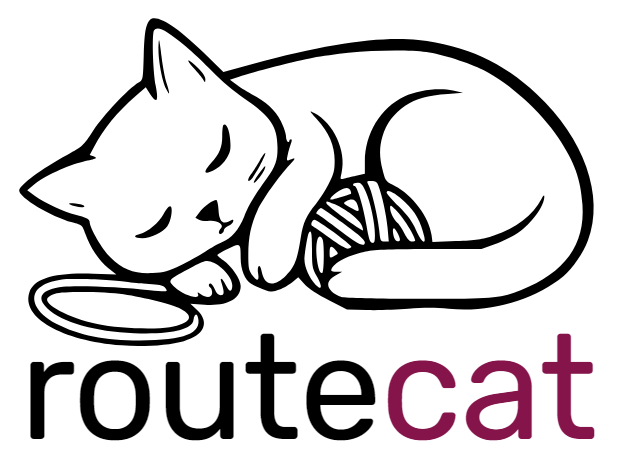

<p align="center"></p>

# RouteCat

**Open-source AI inference gateway** — routes user requests to community GPU nodes, meters tokens transparently, pays providers via Lightning Network.

[route.cat](https://route.cat) · [API Docs](#api) · [Run a Node](#run-a-node) · [Architecture](#architecture) · [Privacy](#privacy) · [Verify](#verify)

> **Status: v0.1 beta** — The gateway is live and serving requests at [route.cat](https://route.cat).

---

## Why RouteCat?

Most AI inference gateways are black boxes: closed-source billing, opaque routing, unverifiable payouts. RouteCat is different:

- **Fully open source** — Every line of code is public. Audit the billing, routing, and payment logic yourself.
- **Privacy first** — We don't log prompts or responses. Provider nodes never see your identity. No emails, no tracking, no cookies.
- **Transparent billing** — Per-token pricing with a flat 5% gateway fee. Every job is logged and publicly auditable via `/v1/audit`.
- **Lightning payments** — Providers earn sats automatically. Users top up with Lightning — no banks, no credit cards.
- **OpenAI compatible** — Drop-in replacement. Change your `base_url` and it works with any OpenAI SDK.
- **Community powered** — Anyone with a GPU can join as a provider node and earn Bitcoin from idle compute.

## Quick start

### As a user (send requests)

```bash
# 1. Get an API key (10 free playground requests/day)
curl -X POST https://route.cat/v1/auth/register \
  -d '{"name":"my app"}'

# 2. Top up your balance with Lightning
curl -X POST https://route.cat/v1/auth/topup \
  -H "Authorization: Bearer rc_YOUR_KEY" \
  -d '{"amount_sats":1000}'
# Returns a Lightning invoice — pay it with any wallet

# 3. Check your balance
curl https://route.cat/v1/auth/balance \
  -H "Authorization: Bearer rc_YOUR_KEY"

# 4. Send a chat completion
curl https://route.cat/v1/chat/completions \
  -H "Authorization: Bearer rc_YOUR_KEY" \
  -H "Content-Type: application/json" \
  -d '{"model":"qwen2.5:7b","messages":[{"role":"user","content":"Hello!"}],"stream":true}'
```

Or with the OpenAI Python SDK:

```python
from openai import OpenAI

client = OpenAI(base_url="https://route.cat/v1", api_key="rc_YOUR_KEY")
response = client.chat.completions.create(
    model="qwen2.5:7b",
    messages=[{"role": "user", "content": "Hello!"}],
    stream=True,
)
for chunk in response:
    print(chunk.choices[0].delta.content or "", end="")
```

### As a provider (earn Bitcoin)

Use our [Owlrun fork](https://github.com/aaronFortuno/owlrun) (multi-language dashboard, modular UI) or any compatible provider client:

```ini
# ~/.owlrun/owlrun.conf
[marketplace]
gateway = https://route.cat

[account]
lightning_address = you@walletofsatoshi.com
```

Restart the client. Your node will register, appear on the network, and start receiving inference jobs.

## API

All endpoints are OpenAI-compatible.

| Method | Endpoint | Auth | Description |
|--------|----------|------|-------------|
| `POST` | `/v1/chat/completions` | Bearer | Chat completion (streaming SSE) |
| `GET`  | `/v1/models` | — | List available models with pricing |
| `POST` | `/v1/auth/register` | — | Create a user API key |
| `POST` | `/v1/auth/topup` | Bearer | Generate Lightning invoice to top up balance |
| `GET`  | `/v1/auth/balance` | Bearer | Check balance and remaining free requests |
| `GET`  | `/v1/stats` | — | Gateway stats: nodes, jobs, version, commit |
| `GET`  | `/v1/audit` | — | Public job log (anonymised billing data) |

### Authentication

```
Authorization: Bearer rc_YOUR_API_KEY
```

API keys start with `rc_` and are shown only once at creation. The free tier (10 requests/day) works only from the web playground. Direct API access requires a positive sats balance.

### Models & pricing

Pricing is per million tokens. Providers keep 95%, the gateway takes a 5% flat fee. Prices scale with model size — from $0.005/M for small models to $0.15/M for large ones.

```bash
curl https://route.cat/v1/models
```

Live pricing, a playground, and an interactive top-up flow are available at [route.cat](https://route.cat).

## Privacy

RouteCat acts as a privacy proxy between users and inference nodes:

- **No prompt logging** — requests are forwarded in real time and never stored
- **No user tracking** — no emails, no cookies, no analytics
- **Anonymous to providers** — nodes receive only the raw model request, never your identity
- **API key = identity** — generated with `crypto/rand`, no personal data attached
- **Open source** — verify these claims by reading the code

## Verify

We believe transparency is earned, not claimed. Three mechanisms:

1. **Source code** — [Read it](https://github.com/aaronFortuno/routecat). Every line is public.
2. **Build hash** — `/v1/stats` returns the git commit hash of the running binary. Rebuild from source and compare: `go build -ldflags "-X main.commit=$(git rev-parse --short HEAD)" ./cmd/routecat`
3. **Audit log** — `/v1/audit` returns the last 100 completed jobs with model, tokens, earnings, and fees. No user keys or prompts — just billing data anyone can verify.

## Architecture

```
Users (buyers)              RouteCat Gateway              Nodes (providers)
──────────────           ─────────────────────          ──────────────────
                         ┌───────────────────┐
POST /v1/chat/       →   │   Public API      │
completions               │  (OpenAI compat)  │
                         ├───────────────────┤
                         │   Router          │  ← model match, VRAM,
                         │                   │    queue depth
                         ├───────────────────┤
                         │  WebSocket Hub    │  ←→  provider nodes
                         │  heartbeat 30s    │      (register, heartbeat,
                         │  job assignment   │       accept/reject,
                         │  proxy streaming  │       proxy chunks)
                         ├───────────────────┤
                         │  Billing Engine   │  ← token metering,
                         │  5% flat fee      │    per-job accounting
                         ├───────────────────┤
                         │  Lightning Payout │  ← LND via Tailscale,
                         │  threshold-based  │    auto-pay to providers
                         ├───────────────────┤
                         │  Invoice Watcher  │  ← user top-ups,
                         │                   │    balance crediting
                         └───────────────────┘
```

### Components

| Package | Description |
|---------|-------------|
| `cmd/routecat` | Entry point, CLI flags, service wiring |
| `internal/gateway` | WebSocket hub, node lifecycle, proxy streaming, HTTP server, rate limiting |
| `internal/router` | Job routing: model match → lowest queue depth |
| `internal/billing` | Token metering, USD→msats conversion, BTC price feed (CoinGecko) |
| `internal/lightning` | LND REST client, LNURL resolution, payout engine, invoice watcher |
| `internal/store` | SQLite: nodes, jobs, payouts, user API keys, invoices, balances |
| `internal/api` | Public API, user registration, top-up, balance, audit log |
| `internal/web` | Embedded frontend (landing, pricing, playground, FAQ, i18n) |

### Protocol

RouteCat implements the same WebSocket protocol as the Owlrun gateway, making it compatible with existing provider nodes:

- **Registration**: `POST /v1/gateway/register` with node ID, GPU info, models, Lightning address
- **Control channel**: `WS /v1/gateway/ws?api_key=X` — heartbeat, job assignment, proxy streaming
- **Job flow**: gateway assigns job → node accepts → node fetches buyer request → streams Ollama response → gateway meters tokens → bills provider and user

## Run a Node

### Requirements

- A GPU (NVIDIA recommended, 8GB+ VRAM)
- [Ollama](https://ollama.com) installed with at least one model
- [Owlrun](https://github.com/aaronFortuno/owlrun) provider client

### Setup

1. Install Ollama and pull a model: `ollama pull qwen2.5:7b`
2. Install [Owlrun](https://github.com/aaronFortuno/owlrun)
3. Edit `~/.owlrun/owlrun.conf`:
   ```ini
   [marketplace]
   gateway = https://route.cat

   [account]
   lightning_address = you@walletofsatoshi.com
   ```
4. Restart Owlrun — your node connects and starts earning

## Self-hosting

Run your own gateway:

```bash
# Build (injects git commit hash)
COMMIT=$(git rev-parse --short HEAD)
go build -ldflags "-X main.version=0.1.0 -X main.commit=$COMMIT" -o routecat ./cmd/routecat

# Run (minimal, no Lightning)
./routecat -addr :8080 -db data/routecat.db -fee 5.0

# Run (with LND payouts)
./routecat -addr :8080 -db data/routecat.db -fee 5.0 \
  -lnd-addr 100.x.x.x:8080 \
  -lnd-macaroon /path/to/admin.macaroon \
  -lnd-tls /path/to/tls.cert
```

### CLI flags

| Flag | Default | Description |
|------|---------|-------------|
| `-addr` | `:8080` | Listen address |
| `-db` | `routecat.db` | SQLite database path |
| `-fee` | `5.0` | Gateway fee percentage |
| `-lnd-addr` | *(none)* | LND REST API address |
| `-lnd-macaroon` | *(none)* | Path to LND macaroon |
| `-lnd-tls` | *(none)* | Path to LND TLS cert |

### Deployment

See [`deploy/`](deploy/) for:
- `routecat.service` — systemd unit file with security hardening
- `Caddyfile` — reverse proxy with auto-HTTPS
- `setup.sh` — VPS setup script (Ubuntu, Caddy, Tailscale)

## Security

- Rate limiting: 60 requests/min per IP, 3 registrations/hour per IP
- Free tier restricted to web playground (prevents API abuse)
- Request body size limit: 1MB
- Constant-time API key comparison (timing attack resistant)
- WebSocket message sender validation (nodes can only complete their own jobs)
- Stale job cleanup: 2-minute timeout
- LND spending cap: 10,000 sats/hour
- Invoice expiry: 10 minutes, idempotent crediting (no double-spend)
- Atomic balance operations (SQLite transactions)
- systemd hardening: `NoNewPrivileges`, `ProtectSystem=strict`

## Tech stack

- **Go** — gateway, routing, billing, API (zero CGO)
- **SQLite** — persistence (nodes, jobs, payouts, invoices, API keys)
- **LND** — Lightning payments via REST API
- **Caddy** — reverse proxy, auto-HTTPS
- **Tailscale** — secure tunnel to LND node

## Contributing

Contributions welcome. The project is MIT licensed.

```bash
git clone https://github.com/aaronFortuno/routecat.git
cd routecat
go build ./cmd/routecat
./routecat -addr :8080 -db test.db
```

## License

MIT — see [LICENSE](LICENSE).
